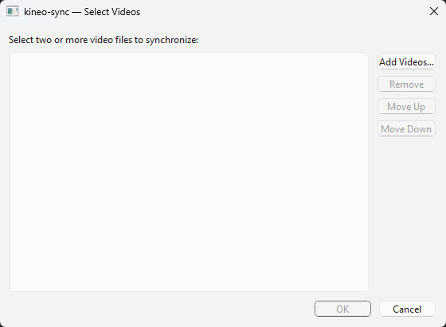
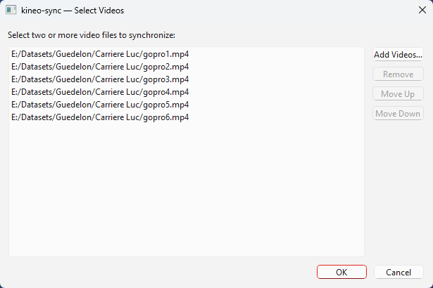
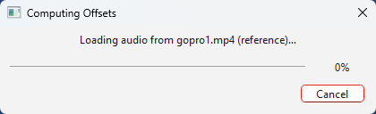
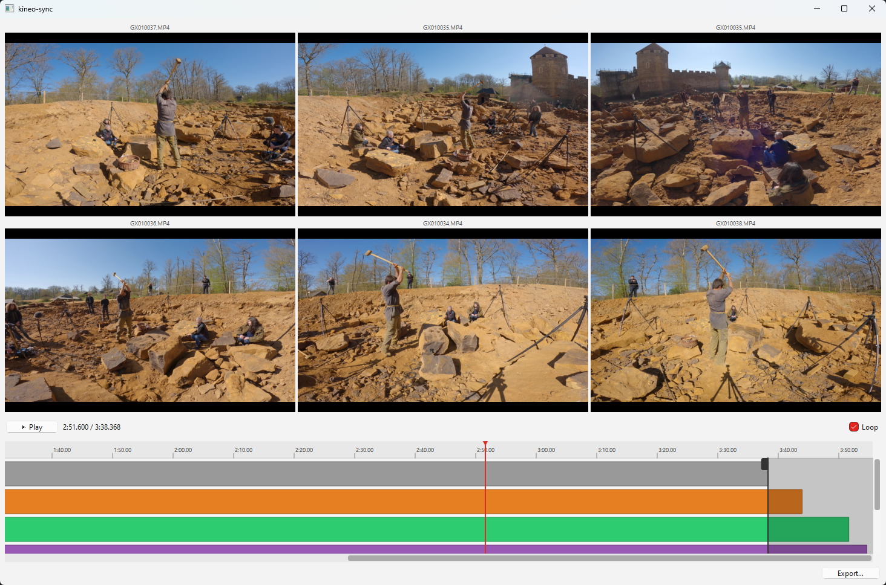
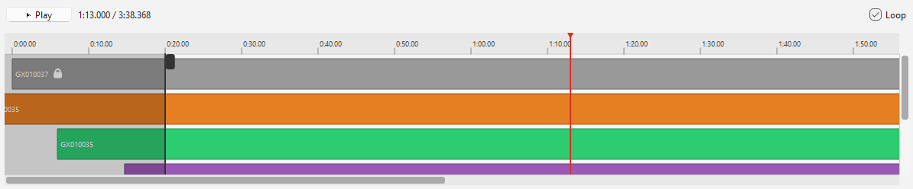
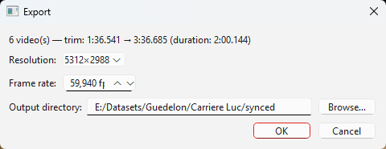

# Manuel utilisateur : clapsync

**clapsync** synchronise des enregistrements vidéo, audio et de capture de
mouvement à partir du son, puis en exporte des copies découpées qui commencent
au même instant et durent exactement aussi longtemps.

Ce manuel décrit l'application graphique (GUI). Pour la ligne de commande ou
l'API Python, voir le [README](../../README.md) du projet.

---

## Sommaire

1. [Introduction](#1-introduction)
2. [Installation et lancement](#2-installation-et-lancement)
3. [Sélection des fichiers](#3-sélection-des-fichiers)
4. [Synchronisation automatique](#4-synchronisation-automatique)
5. [Capture de mouvement (`.c3d`)](#5-capture-de-mouvement-c3d)
6. [L'éditeur de synchronisation](#6-léditeur-de-synchronisation)
7. [Exportation des résultats](#7-exportation-des-résultats)
8. [Résultat attendu](#8-résultat-attendu)
9. [Dépannage](#9-dépannage)
10. [Annexe : raccourcis clavier](#10-annexe--raccourcis-clavier)

> La section 5 concerne uniquement la capture de mouvement. Si vous ne
> synchronisez que des vidéos et des enregistrements sonores, passez-la.

---

## 1. Introduction

Filmez un même instant avec plusieurs caméras, enregistreurs ou systèmes de
capture démarrés à des moments différents, puis laissez clapsync les aligner en
écoutant leur audio. L'outil produit des copies découpées qui commencent toutes
au même instant et ont exactement la même durée, prêtes pour un montage
multicam ou un pipeline de reconstruction.

Idéal pour les tournages multicam, interviews, concerts, et toute prise devant
laquelle vous avez claqué un clap. 👏

### Points clés

* **Synchronisation automatique** par empreinte audio (coefficients MFCC),
  robuste aux différences de micros et de gain.
* **Vidéo, audio ou les deux** : tout fichier possédant une piste sonore se
  synchronise de la même façon. Un lot purement audio fonctionne aussi.
* **Capture de mouvement** : les fichiers `.c3d` rejoignent la même timeline
  grâce au clap (voir §5).
* **Précision inférieure à l'image** : les décalages sont conservés en secondes
  flottantes, donc audio et vidéo restent calés même quand le décalage réel
  tombe entre deux images.
* **Édition manuelle** pour corriger un calage ou définir la zone de découpe.
* **Export groupé** vers une résolution, une fréquence et un format audio
  communs.

---

## 2. Installation et lancement

### Option A : installateur Windows

Téléchargez `clapsync-setup-<version>.exe` depuis la
[page des releases](https://github.com/cjaverliat/clapsync/releases/latest) et
exécutez-le. L'installation se fait par utilisateur dans `%LOCALAPPDATA%\clapsync`,
sans droits administrateur, puis télécharge l'environnement verrouillé (~2 Go de
téléchargement, ~8 Go sur disque) : **une connexion internet est requise pendant
l'installation**.

> L'installateur n'est pas signé : au premier lancement, Windows SmartScreen
> affiche un avertissement « application non reconnue ». Choisissez
> **Informations complémentaires → Exécuter quand même**.

clapsync utilise un GPU NVIDIA s'il en trouve un, et bascule sur le processeur
sinon (synchronisation et export plus lents, résultat identique).

### Option B : depuis les sources ([pixi](https://pixi.sh))

```bash
pixi install
pixi run clapsync
```

### Au démarrage

Avant d'ouvrir la fenêtre de sélection, clapsync affiche brièvement deux
messages d'attente : « Checking environment… » (détection du GPU) puis
« Initializing audio devices… ». Sur certaines machines Windows, l'énumération
des périphériques audio prend une dizaine de secondes au premier lancement.
C'est normal et cela n'arrive qu'une fois par session.

---

## 3. Sélection des fichiers

Constituez ici le groupe de fichiers à synchroniser.



* **Ajouter des fichiers** : cliquez sur **Add Media…**. Formats acceptés :
  * vidéo : `.mp4`, `.mov`, `.avi`, `.mkv`, `.mts`, `.m2ts`, `.webm`, `.flv`,
    `.wmv` ;
  * audio : `.wav`, `.mp3`, `.flac`, `.m4a`, `.aac` ;
  * capture de mouvement : `.c3d` (voir §5).
* **Définir la référence** : l'ordre de la liste compte. Le **premier fichier
  porteur d'une piste sonore** sert de référence temporelle (décalage = 0) et
  tous les autres sont calés sur lui. Utilisez **Move Up** / **Move Down** pour
  réordonner. Un `.c3d` ne peut jamais être la référence : s'il figure en tête,
  clapsync prend le premier fichier sonore de la liste.
* **Supprimer** : sélectionnez une ou plusieurs entrées et cliquez sur
  **Remove**.
* **Valider** : cliquez sur **OK**. Le bouton s'active dès que **2 fichiers au
  moins** sont présents.



> **Prérequis** : chaque fichier vidéo ou audio doit posséder une piste sonore
> exploitable, c'est elle que la synchronisation écoute. Les `.c3d` font
> exception et sont traités séparément (§5).

---

## 4. Synchronisation automatique

Après validation, clapsync lit les fichiers puis analyse leur audio sans
intervention.



Les pistes audio sont extraites puis comparées par corrélation de leurs
coefficients MFCC (*Mel-Frequency Cepstral Coefficients*), une empreinte robuste
aux différences de micros et d'égalisation. Un pic de corrélation donne le
décalage de chaque fichier, affiné en dessous de l'image.

* **Progression** : une barre indique l'avancement, avec un bouton d'annulation.
* **Confiance faible** : si une piste n'obtient pas de correspondance nette
  (audio trop différent, piste silencieuse), une fenêtre **Low sync confidence**
  liste les pistes concernées et leur score. Elles restent chargées, avec un
  décalage possiblement faux, et sont signalées par un **⚠** dans le panneau de
  gauche de la timeline. Corrigez-les à la main dans l'éditeur (§6.4).

---

## 5. Capture de mouvement (`.c3d`)

> Section optionnelle. Passez directement au §6 si vous ne synchronisez pas de
> capture de mouvement.

Un fichier `.c3d` ne contient pas de son. clapsync le place sur la timeline
commune en s'appuyant sur le clap : il repère le claquement dans l'audio des
caméras et des enregistreurs, repère la fermeture du clap dans les trajectoires
de marqueurs, et fait coïncider les deux.

### 5.1 Marqueurs du clap

Votre clapperboard doit porter des marqueurs sur ses deux bras. clapsync les
regroupe d'après leurs noms : un nom contenant un mot-clé de clap (`clap` ou
`slate`) plus une direction (`top`, `upper`, `up` pour le bras supérieur ;
`bottom`, `lower`, `low`, `down` pour le bras inférieur). La casse est ignorée,
donc `Clap_Top_1` et `slate_bottom_L` sont reconnus.

Si les marqueurs ne peuvent pas être identifiés, une fenêtre **Select
clapperboard markers** s'ouvre avant l'analyse : sélectionnez un ou plusieurs
marqueurs pour chaque bras. Annuler laisse le fichier non synchronisé
(décalage 0) avec un avertissement.

### 5.2 Détection du clap

clapsync suit ensuite l'écartement des deux bras et ignore les images où les
marqueurs sont occultés ou visiblement mal suivis. Une capture contient souvent
plusieurs fermetures (un essai de positionnement, puis le vrai clap) : la plus
franche est retenue. Sans clap exploitable, la piste reste à 0 avec un
avertissement. clapsync ne devine jamais.

### 5.3 Vérifier et corriger dans l'éditeur

Dans l'éditeur, un `.c3d` occupe une cellule de la mosaïque affichant ses
marqueurs, animés en même temps que les vidéos. La timeline affiche deux
drapeaux : le clap détecté dans le `.c3d` et le son de clap correspondant sur
les pistes audio ou vidéo.

Si le repérage est faux, deux boutons en bas de la fenêtre corrigent le lien :

* **Set c3d clap (at playhead)** : amenez la tête de lecture sur la vraie
  fermeture du clap dans la capture, puis cliquez. Le `.c3d` est déplacé pour
  que cette image tombe sur le son de clap.
* **Set clap sound (at playhead)** : amenez la tête de lecture sur le claquement
  entendu dans l'audio, puis cliquez. Le point sonore est redéfini et le `.c3d`
  resynchronisé.

Dans les deux cas, le recalage est immédiat et la zone de découpe est ramenée au
chevauchement de toutes les pistes.

### 5.4 À l'export

Un `.c3d` ne produit pas de fichier de capture découpé, mais un fichier texte
`{nom}_trim.txt` à côté des pistes exportées, contenant les images de début et de
fin de la découpe **dans la numérotation propre au fichier `.c3d`** :

```
start_frame: 412
end_frame: 3187
```

Découpez la prise dans votre outil de capture ; clapsync ne réécrit jamais votre
fichier. Si la découpe déborde de la capture, les numéros sortent de sa plage
(voire deviennent négatifs) au lieu d'être ramenés à ses bornes, pour que le
remplissage reste visible.

---

## 6. L'éditeur de synchronisation

> **Proxies de prévisualisation (sources haute résolution).** Si l'un de vos
> fichiers dépasse 1080p, clapsync propose de générer des *proxies* légers en
> 480p pour une lecture fluide dans l'éditeur. Répondez **Yes** (recommandé, par
> défaut) pour lancer un transcodage unique, ou **No** pour lire les originaux.
> L'export utilise toujours les fichiers d'origine en pleine résolution, quel
> que soit ce choix.

L'éditeur regroupe trois zones : la prévisualisation, les contrôles de lecture
et la timeline.



### 6.1 La prévisualisation

Une mosaïque affiche en parallèle toutes les sources visuelles, chacune surmontée
du nom de son fichier : les vidéos, et les `.c3d` sous forme de nuage de
marqueurs. Les fichiers purement audio n'occupent pas de cellule ; leur forme
d'onde est dessinée dans leur piste sur la timeline.

Les sources avancent ensemble selon leurs décalages : vous voyez immédiatement
si le calage est correct. Un voile **« Loading… »** apparaît brièvement lors des
chargements ou des sauts importants.

### 6.2 Les contrôles de lecture

Situés entre la mosaïque et la timeline :

* **◀ / ▶** : recule ou avance d'une image (touches `←` et `→`). Le pas
  correspond à la cadence la plus fine présente, capture de mouvement comprise.
  La lecture se met en pause pour un réglage précis.
* **Play / Pause** : bouton central, ou touche `Espace`.
* **Indicateur de temps** : format `position / durée` (`m:ss.mmm`), calé sur la
  zone de découpe.
* **Zoom** : les trois boutons à droite réduisent, agrandissent ou ajustent la
  timeline à la fenêtre.
* **Loop** : coché par défaut. La lecture reboucle sur la zone de découpe.
  Décochez pour qu'elle s'arrête à la fin de la zone.

### 6.3 La timeline

La timeline place chaque piste sur l'axe temporel global. La piste de référence
est **grise et verrouillée** (icône cadenas) ; les autres sont colorées. Les
pistes porteuses de son affichent leur forme d'onde, ce qui aide à repérer un
clap à l'œil.



Le panneau fixe de gauche rappelle, pour chaque piste : son nom, une icône de
type, un **⚠** si la synchronisation automatique est peu fiable, et un bouton de
**sourdine** pour couper son audio pendant la prévisualisation.

#### Navigation et zoom

* **Déplacer la lecture** : cliquez ou faites glisser n'importe où pour amener
  la **tête de lecture** (trait rouge) à cet instant.
* **Zoomer** : `Ctrl + Molette` agrandit ou réduit l'échelle de temps autour du
  curseur.
* **Défiler** : la `Molette` seule fait défiler horizontalement. Une barre
  verticale apparaît si les pistes ne tiennent pas toutes en hauteur.

### 6.4 Corriger un décalage (offset)

Si le calcul automatique n'est pas parfait :

1. **Double-cliquez** sur le bloc coloré de la piste à corriger (le bloc gris de
   référence n'est pas modifiable).
2. Dans la fenêtre **Set Offset**, saisissez le décalage exact en secondes
   (précision au millième).
3. **Astuce** : repérez un événement bref à la fois visible et sonore (un clap)
   et calez les pistes dessus, forme d'onde à l'appui.

Ajuster un décalage réaligne aussitôt la prévisualisation et peut resserrer la
zone de découpe si nécessaire. Pour une piste de capture de mouvement, utilisez
plutôt les boutons de clap (§5.3).

### 6.5 Définir la zone de découpe

Les **poignées** aux deux extrémités délimitent l'intervalle conservé à
l'export. À l'ouverture, la zone couvre le **chevauchement commun** à toutes les
pistes, capture de mouvement comprise.

* Glissez la poignée **gauche** vers la droite pour retarder le début.
* Glissez la poignée **droite** vers la gauche pour avancer la fin.
* Les zones grisées hors des poignées ne seront pas exportées.

---

## 7. Exportation des résultats

Réglage terminé, cliquez sur **Export…**.



Un résumé rappelle le nombre de pistes, la zone de découpe et sa durée. Réglez
ensuite :

* **Tracks** : toutes les pistes sont cochées par défaut. Décochez celles que
  vous ne voulez pas exporter.
* **Resolution** : la première option, **Native**, correspond à la plus petite
  résolution détectée parmi les vidéos sélectionnées ; les suivantes proposent
  des hauteurs standard *inférieures* (2160p, 1440p, 1080p, 720p, 480p) au ratio
  d'origine. clapsync n'agrandit jamais au-delà de la source.
* **Frame rate** : **Native** correspond à la fréquence la plus basse détectée ;
  les options suivantes proposent des fréquences standard inférieures (60, 50,
  30, 25, 24 fps).
* **Audio format** : **Same as source**, ou `wav`, `flac`, `mp3`, `m4a`.
* **Sample rate** : **Native**, 44100 ou 48000 Hz.
* **Bitrate** : actif uniquement pour les formats compressés (`mp3`, `m4a`).
* **Output directory** : saisissez un chemin ou cliquez sur **Browse…**.

Les réglages de résolution et de fréquence disparaissent si aucune vidéo n'est
sélectionnée.

Cliquez sur **OK** pour lancer l'export. Une fenêtre de progression s'affiche,
avec un bouton **Cancel** pour l'interrompre.

Fichiers produits, dans le dossier de sortie :

| Source | Sortie |
|---|---|
| Vidéo | `{nom}_synced.mp4` |
| Audio | `{nom}_synced.<ext>` |
| Capture de mouvement | `{nom}_trim.txt` (voir §5.4) |

> **Note technique : remplissage des trous.** Si une piste commence après le
> début de la zone de découpe, clapsync insère automatiquement des images noires
> et du silence au début du fichier ; de même en fin de piste. Toutes les pistes
> exportées partagent ainsi la même « image 0 » et la même durée.

> **GPU ou CPU.** L'encodage utilise le GPU (NVENC `h264_nvenc`) quand il est
> disponible, avec bascule automatique sur le processeur (`libx264`) sinon.
> L'export CPU est plus lent mais donne le même résultat.

À la fin, un message récapitule les fichiers écrits, ou les erreurs éventuelles
piste par piste.

---

## 8. Résultat attendu

Vous obtenez dans le dossier de sortie un fichier par piste sélectionnée :

1. **Synchronisés** : ils commencent tous au même instant.
2. **De durée identique** : prêts pour une importation directe dans un montage
   multicam ou un pipeline de reconstruction.
3. **Accompagnés des découpes de capture** : chaque `.c3d` a son fichier de
   plage d'images à appliquer dans votre outil de capture.

---

## 9. Dépannage

| Symptôme | Cause probable | Solution |
|---|---|---|
| Le bouton **OK** de la sélection reste grisé | Moins de 2 fichiers dans la liste | Ajoutez au moins deux fichiers. |
| Un fichier est refusé à l'ouverture | Format ou fichier illisible | Vérifiez qu'il figure parmi les formats acceptés (§3) et qu'il n'est pas corrompu. |
| La fenêtre **Low sync confidence** s'affiche | Aucune correspondance audio nette (piste silencieuse, micro trop différent) | Vérifiez les pistes marquées d'un ⚠ et corrigez leur décalage à la main (§6.4). |
| Le calage est proche mais pas parfait | Précision limitée par l'audio | Zoomez sur un clap, appuyez-vous sur les formes d'onde et affinez l'offset au millième (§6.4). |
| Le démarrage se fige sur « Initializing audio devices… » | Énumération des périphériques audio Windows, lente au premier lancement | Patientez ; les lancements suivants sont rapides. |
| La prévisualisation reste noire ou « Loading… » persiste | Décodage lent d'une source haute résolution | Patientez, ou acceptez les proxies de prévisualisation au démarrage de l'éditeur (§6). |
| Un `.c3d` reste calé à 0 | Marqueurs de clap non identifiés, ou aucune fermeture détectée | Sélectionnez les marqueurs à la main, puis recalez avec les boutons de clap (§5). |
| Aucun bouton de clap en bas de l'éditeur | Aucune piste `.c3d` dans le lot | Comportement attendu : ces boutons n'apparaissent qu'avec une capture de mouvement. |
| L'export est lent | Encodage sur processeur (pas de GPU NVENC exploitable) | Normal sans GPU compatible. Une résolution ou une fréquence plus basse accélère l'export. |
| Certaines vidéos exportées commencent par du noir | Remplissage volontaire des trous | Comportement attendu : garantit une « image 0 » commune (§7). |
| SmartScreen bloque l'installateur | Installateur non signé | **Informations complémentaires → Exécuter quand même** (§2). |

---

## 10. Annexe : raccourcis clavier

| Action | Raccourci |
|---|---|
| Lecture / Pause | `Espace` |
| Image précédente / suivante | `←` / `→` |
| Zoomer / dézoomer la timeline | `Ctrl + Molette` |
| Défiler la timeline | `Molette` |
| Déplacer la tête de lecture | Clic ou glisser sur la timeline |
| Modifier le décalage d'une piste | Double-clic sur son bloc coloré |
| Couper le son d'une piste | Clic sur l'icône de sourdine, panneau de gauche |
